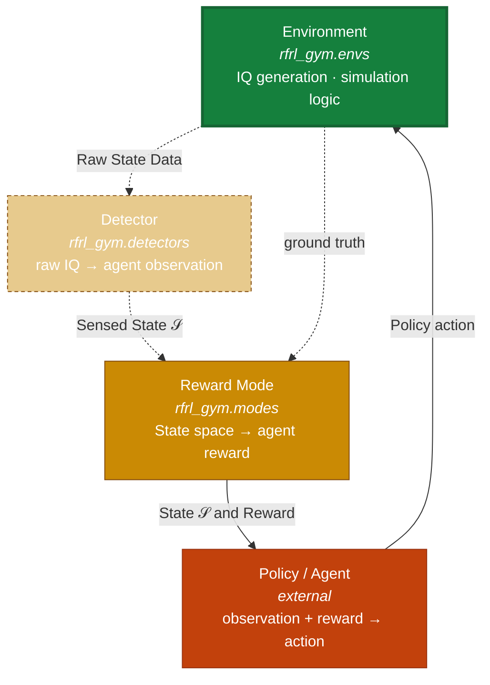

# RFRL-Gym

RFRL-Gym: a modular Gymnasium-based framework for RF reinforcement learning. Work derived from
([VTNSI rfrl-gym](https://github.com/vtnsi/rfrl-gym/tree/master)).

RFRL-Gym decomposes the RF reinforcement-learning problem into four independently
modular components:

1. [](https://github.com/SLeathersII/rfrl/blob/main/rfrl-gym-docs/docs/api_envs.md)
   — the **environment / scene handler**. Owns the RF simulation itself: IQ data
   generation, channel state, entity behavior, and scenario bookkeeping
   (e.g. [](https://github.com/SLeathersII/rfrl/blob/main/rfrl-gym-docs/docs/api_envs.md)).

2. [](https://github.com/SLeathersII/rfrl/blob/main/rfrl-gym-docs/docs/api_detectors.md)
   — the **sensing layer**. A wrapper that turns the environment's raw IQ
   output into the observation an agent actually sees (e.g. detection or
   classification results). Defines observation space and encoding.

3. [](https://github.com/SLeathersII/rfrl/blob/main/rfrl-gym-docs/docs/api_modes.md)
   — the **objective layer**. A wrapper that defines the environment's reward
   logic and outputs reward signal
   (e.g. [](https://github.com/SLeathersII/rfrl/blob/main/rfrl-gym-docs/docs/api_modes.md),
   [](https://github.com/SLeathersII/rfrl/blob/main/rfrl-gym-docs/docs/api_modes.md)).

4. **Policy / agent** — the learning algorithm, external to this package,
   that adheres to the standard [Gymnasium](https://gymnasium.farama.org/)
   interface. Because the entire wrapper stack (environment → detector →
   reward mode) ultimately still exposes a standard `gym.Env`, the
   policy/agent side only ever needs to know about `reset()` and `step()`.:

   - `reset()` → returns the initial `(observation, info)`.
   - `step(action)` → returns `(observation, reward, terminated, truncated, info)`
In practice this means you can drop the composed environment
   straight into:

   - [**Stable-Baselines3**](https://stable-baselines3.readthedocs.io/) — PyTorch implementations of common algorithms (PPO, SAC, DQN, etc.), the library used in the `Getting Started` tutorial's test script.
   - [**RLlib**](https://docs.ray.io/en/latest/rllib/) (Ray) — scalable, distributed training across many algorithms and multi-agent setups.
   - [**CleanRL**](https://docs.cleanrl.dev/) — single-file, research-oriented reference implementations, useful if you want to read or modify the training loop directly rather than treat it as a black box.
   - Or a fully custom training loop written directly against `reset()`/`step()`.
     
Each wrapper layer allows independent functional composition, with dependencies
derived only from the layer above it. The RFRL-Gym environment is assembled by
stacking wrappers around a base environment:

```python
env = gym.make('rfrl-gym-iq-v0.1', scenario_filename='sb3_test_scenario.json',
               pywasp_config="pywaspgen/configs/default.json",
               num_episodes=1)   # 1. scene handler / IQ generator
env = OracleMap(env, 'detect')   # 2. sensing layer, shapes the observation
env = DSA(env)                   # 3. reward mode, shapes the reward
# 4. policy/agent trains against `env` as a standard Gymnasium environment
```



| Layer                  | Package                                                                                                      | Owns                                                          | Wraps                    |
| ----------------------- | -------------------------------------------------------------------------------------------------------------| -------------------------------------------------------------- | ------------------------ |
| **1. Environment**      | [`rfrl_gym.envs`](https://github.com/SLeathersII/rfrl/blob/main/rfrl-gym-docs/docs/api_envs.md)               | RF simulation, IQ generation, channel state, scenario config  | — (base)                 |
| **2. Detector**         | [`rfrl_gym.detectors`](https://github.com/SLeathersII/rfrl/blob/main/rfrl-gym-docs/docs/api_detectors.md)     | Sensing: raw IQ → observation                                  | Environment              |
| **3. Reward Mode**      | [`rfrl_gym.modes`](https://github.com/SLeathersII/rfrl/blob/main/rfrl-gym-docs/docs/api_modes.md)             | Reward function defining the operational mode                 | Environment (+ Detector) |
| **4. Policy / Agent**   | *external*                                                                                                    | Action selection                                                | Gym                      |

## Tutorials

- [`Getting Started`](https://github.com/SLeathersII/rfrl/blob/main/rfrl-gym-docs/docs/api_getting_started.md) — running the stable-baselines3 test script.
- [`Scenario Files and Scene Generation`](https://github.com/SLeathersII/rfrl/blob/main/rfrl-gym-docs/docs/scenario_configs.md) — scenario file hyperparameters and composition for experiment design.
