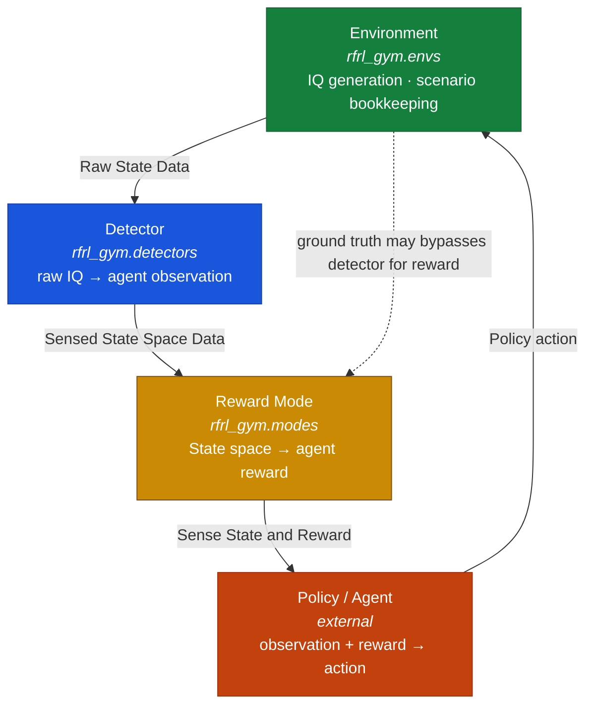

# RFRL-Gym

RFRL-Gym: a modular Gymnasium-based framework for RF reinforcement learning. Work derived from
([VTNSI rfrl-gym](https://github.com/vtnsi/rfrl-gym/tree/master))

This RFRL-Gym decomposes the RF reinforcement-learning problem into four
independently module components:

1. :mod:`rfrl_gym.envs` -- the **environment / scene handler**. Owns the RF
   simulation itself: IQ data generation, channel state, entity behavior,
   and scenario bookkeeping (e.g. :class:`~rfrl_gym.envs.RFRLGymIQEnv2`).
2. :mod:`rfrl_gym.detectors` -- the **sensing layer**. A wrapper that turns
   the environment's raw IQ output into the observation an agent actually
   sees (e.g. detection or classification results). Defines observation space and encoding.
3. :mod:`rfrl_gym.modes` -- the **objective layer**. A wrapper that
   defines the environment's reward logic and outputs reward signal.
   (e.g. :class:`~rfrl_gym.modes.DSA`, :class:`~rfrl_gym.modes.Jam`).
4. **Policy / agent** -- the learning algorithm, external to this package,
   that consumes the detector's observations and the reward mode's reward
   to select actions.

Each wrapper layer should allow independent functional composition with dependencies only derived from the outputs from
the layer above. The RFRL-Gym environment is
assembled by stacking wrappers around a base environment:

```python
env = gym.make('rfrl-gym-iq-v0.1', scenario_filename='sb3_test_scenario.json',
               pywasp_config = "pywaspgen/configs/default.json",
               num_episodes=1)     # 1. scene handler / IQ generator
env = OracleMap(env, 'detect')    # 2. sensing layer, shapes the observation
env = DSA(env)              # 3. reward mode, shapes the reward
# 4. policy/agent trains against `env` as a standard Gymnasium environment
```



| Layer | Package | Owns                                         | Wraps                    |
|---|---|----------------------------------------------|--------------------------|
| **1. Environment** | [`rfrl_gym.envs`](api_envs.md) | RF simulation, IQ generation, channel state, scenario config | — (base)                 |
| **2. Detector** | [`rfrl_gym.detectors`](api_detectors.md) | Sensing: raw IQ → observation                | Environment              |
| **3. Reward Mode** | [`rfrl_gym.modes`](api_modes.md) | reward function defining the operational mode| Environment (+ Detector) |
| **4. Policy / Agent** | *external* | Action selection                             | Gym                      |


Tutorials
--------
* [`Getting Started`](api_getting_started.md)  : running stable-baseline3 test script.
* [`Scenario Files and Scene Generation`](scenario_configs.md)  : Detail scenario file hyper parameters 
and composition for experiment design. 
