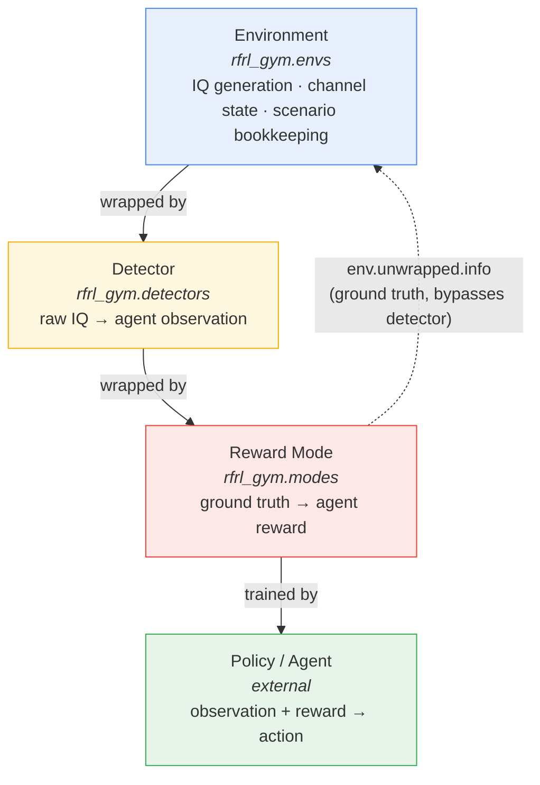

# Architecture

RFRL-Gym decomposes an RF reinforcement-learning problem into **four independently swappable components**, each implemented as a [Gymnasium `Wrapper`](https://gymnasium.farama.org/api/wrappers/){:target="_blank"} layered on top of the one below it.

!!! info "Design principle"
    Every layer depends only on the **interface** of the layer beneath it, never its internal implementation. This is what makes environments, detectors, and reward modes freely recombinable — swap any one out without touching the others.

## The stack



| Layer | Package | Owns | Wraps |
|---|---|---|---|
| **1. Environment** | [`rfrl_gym.envs`](api_envs.md) | RF simulation, IQ generation, channel state, scenario config | — (base) |
| **2. Detector** | [`rfrl_gym.detectors`](api_detectors.md) | Sensing: raw IQ → observation | Environment |
| **3. Reward Mode** | [`rfrl_gym.modes`](api_modes.md) | Objective: ground truth → reward | Environment (+ Detector) |
| **4. Policy / Agent** | *external* | Action selection | Reward Mode |

## Composing a stack

A trained agent is built by wrapping a base environment in a detector, then a reward mode, in that order:

=== "Minimal example"

    ```python
    from rfrl_gym.envs import RFRLGymIQEnv2
    from rfrl_gym.modes import DSA

    env = RFRLGymIQEnv2(
        scenario_filename="dsa_scenario.json",
        pywasp_config="pywasp.json",
    )
    env = DSA(env)

    obs, info = env.reset()
    obs, reward, terminated, truncated, info = env.step(action)
    ```

=== "With a detector"

    ```python
    from rfrl_gym.envs import RFRLGymIQEnv2
    from rfrl_gym.detectors import SomeDetector
    from rfrl_gym.modes import Jam

    env = RFRLGymIQEnv2(
        scenario_filename="jam_scenario.json",
        pywasp_config="pywasp.json",
    )
    env = SomeDetector(env)   # shapes the observation
    env = Jam(env)            # shapes the reward, independent of the detector

    obs, info = env.reset()
    obs, reward, terminated, truncated, info = env.step(action)
    ```

!!! warning "Reward is never intrinsic to an environment"
    A base RFRL-Gym environment produces IQ data and advances scenario state, but **does not** return a meaningful reward on its own. It must be composed with a [`RewardMode`](api_modes.md#rfrl_gym.modes.RewardMode) subclass before it is usable for RL training.

## Why reward is its own layer

Splitting the objective out from both the environment and the detector keeps all four components orthogonal:

- **Environment-agnostic reward.** The same reward mode (`DSA`, `Jam`, or a custom one) works against any environment, unmodified.
- **Detector-agnostic reward.** Reward modes read ground truth via `env.unwrapped.info` — Gymnasium's `.unwrapped` reaches straight through any detector or other wrapper in between, so reward computation is unaffected by whichever detector is shaping the agent's observation.
- **Independent development.** A new reward mode can be built and evaluated against any existing environment/detector pair without modifying either.

??? note "Where ground-truth telemetry actually lives"
    Reward modes don't maintain their own copy of simulation state. They read and write directly into the base environment's own telemetry — `env.unwrapped.info['true_history']`, `env.unwrapped.info['action_history']`, `env.unwrapped.info['reward_history']`, `env.unwrapped.info['cumulative_reward']` — so logging, rendering, and any other consumer of `info` stay consistent no matter which reward mode is active.

## Building a custom reward mode

Every reward mode subclasses [`RewardMode`](api_modes.md#rfrl_gym.modes.RewardMode), which defines the contract but raises `NotImplementedError` on its own — it's a skeleton, not a usable objective. [`DSA`](api_modes.md#rfrl_gym.modes.DSA) and [`Jam`](api_modes.md#rfrl_gym.modes.Jam) are the reference implementations and double as templates:

1. Treat action `-1` as a no-op / backoff → reward `0`.
2. Otherwise, score the action against ground truth read from `env.unwrapped.info` at the current `step_number`.
3. Write the result — and a running cumulative total — back into `reward_history` / `cumulative_reward`.

| Reward mode | Objective | Scored against |
|---|---|---|
| [`DSA`](api_modes.md#rfrl_gym.modes.DSA) | Avoid collisions (opportunistic access) | `true_history` — is the chosen channel occupied? |
| [`Jam`](api_modes.md#rfrl_gym.modes.Jam) | Align with a target (electronic attack) | `action_history` — does the chosen channel match the target's? |

A custom objective — spectral-footprint minimization, a continuous SINR-based reward, or anything else — follows the same pattern: subclass `RewardMode`, read whatever ground-truth fields the objective needs, and write back to the same telemetry fields for consistency with the rest of the framework.

---

See the API reference for full class and method documentation: [Environments](api_envs.md) · [Detectors](api_detectors.md) · [Modes](api_modes.md).
